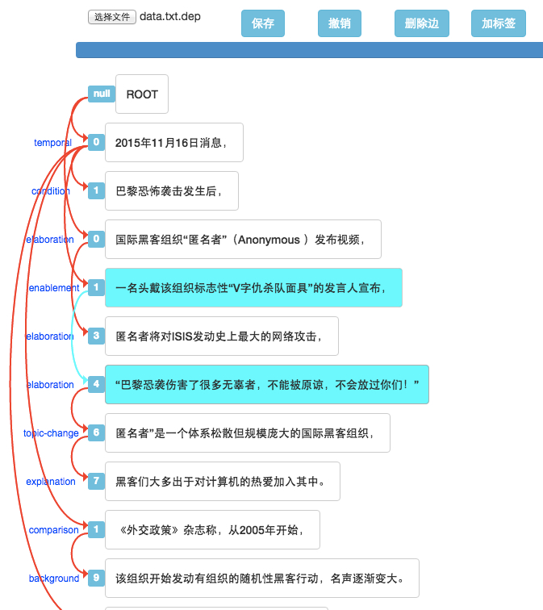

# 依存树标注工具



## 运行

依赖库安装

    bower install
    
在当前目录启动任何一个[web server](https://en.wikipedia.org/wiki/Web_server),比如:

    python -m SimpleHTTPServer

访问```127.0.0.1:8000```即可

## 已实现功能

1.图形化标注

2.支持上一步操作的撤销

3.支持将部分标注结果以json数据格式导出到本地，同时可直接加载json数据

4.支持增、删标签集，自定义标签集

5.支持边的自动高亮

6.支持边的删除操作

## 感谢以下开源项目

[bootstrap](https://github.com/twbs/bootstrap)

[jquery](https://github.com/jquery/jquery)

[FileSaver.js](https://github.com/eligrey/FileSaver.js)

[Angular](https://github.com/angular/angular)

[Underscore.js](https://github.com/jashkenas/underscore)

[ng-file-upload](https://github.com/danialfarid/ng-file-upload)

[ngToast](https://github.com/tameraydin/ngToast)

## 设计原则

1.界面极简

2.不依赖服务器端，100%运行在客户端

## Live demo

可以访问[http://115.28.130.129/annotator](http://115.28.130.129/annotator)

## 注意事项

1.文件编码仅支持utf-8，非utf-8请先用iconv转化。

## bug报告或改进建议

请在[issue](https://github.com/intfloat/dep-annotate/issues)页指出，谢谢。
